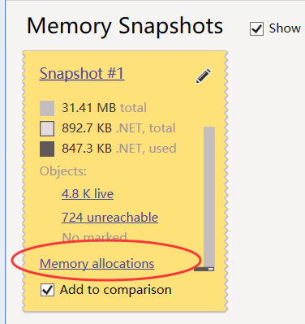
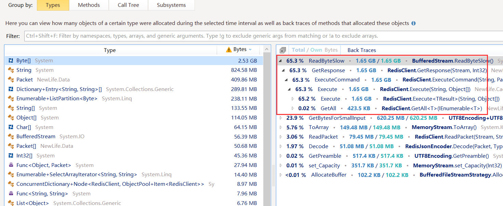
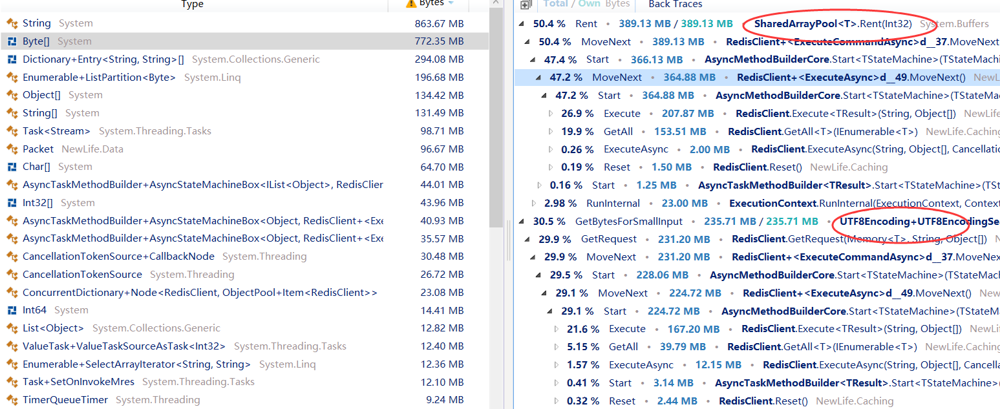

# dotMemory分析Redis的GC分配

​	NewLife组件进入v11时代，重点是减少内存GC。NewLife.Redis作为第一站试用，目标是Redis指令收发过程中，减少内存分配，降低GC。

​	本文对基础要求很高，假定你熟悉dotMemory并阅读过NewLife.Redis源代码。

## 改进前分析

​	Test测试项目改为Test2，启用Bench压测。该压测会执行数百万次Redis操作，可以观测到大量GC。

​	直接查看内存分配：

​	得知内存分配最多的是这里：

​	由此得知，我们需要优化GetResponse，让它使用内存池。当然，在那之前，我们先关闭缓冲流BufferedStream。

## 去掉缓冲流

​	去掉缓冲流，再次测试。Byte[]的内存分配竟然从2.53G下降到905M，看样子它的设计并不好。

​	至此，可以发现，最大内存消耗来自于Encode，也就是把参数转为字节数组的环节。

## 优化Encode

​	采用Span优化Encode，对于字符串，直接编码转换，避免再次分配字节数组。

​	字节数组分配降到772M，现在的问题是，无法准确估算缓冲区大小，导致借出内存过大，产生LOH分配。

## 完全Encode参数

​	执行命令前，先把参数Encode编码为字符串或字节数组，方便Span写入。其实绝大部分场景都是字符串。Byte[]分配下降到263M。

